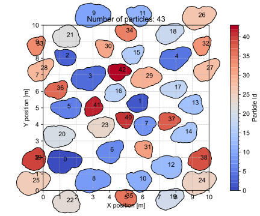
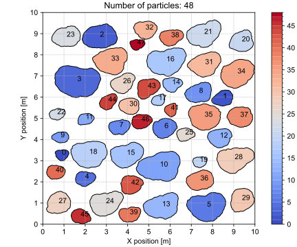
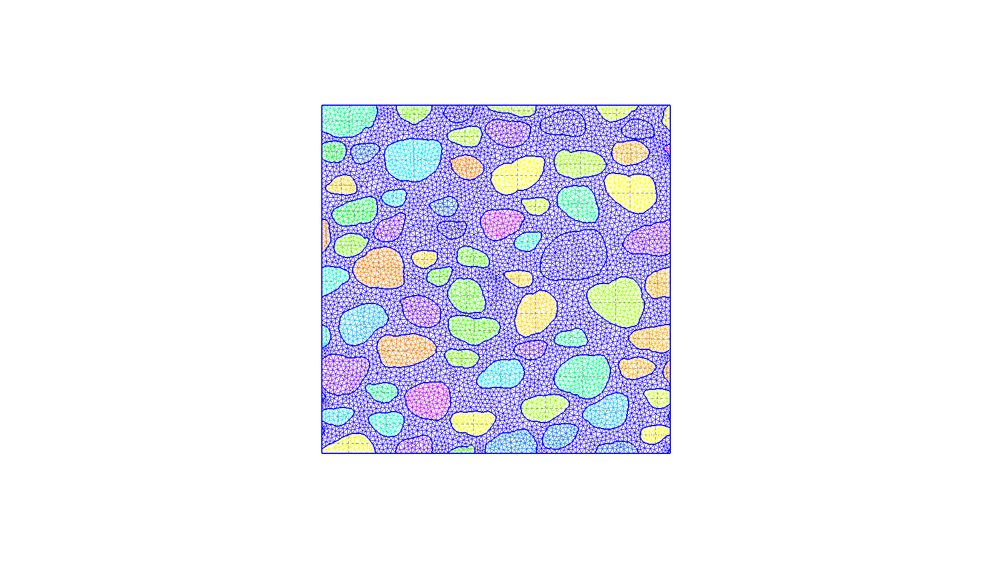
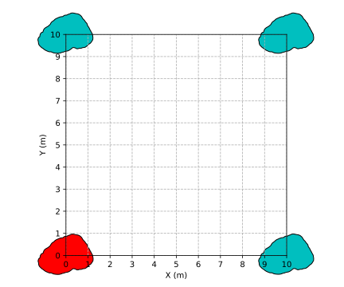

# Overview

A complex discrete fourier transform (DFT) based generator for irregular particles accouting for grading curves, morphology as well as content ratio.

# Gallery

**Fig.1** Irregular particles with periodic boundary.

**Fig.2** Irregular particles with non-periodic boundary.

**Fig.3** Irregular particles with triangularion.

**Fig.4** Ghost particles at corners
